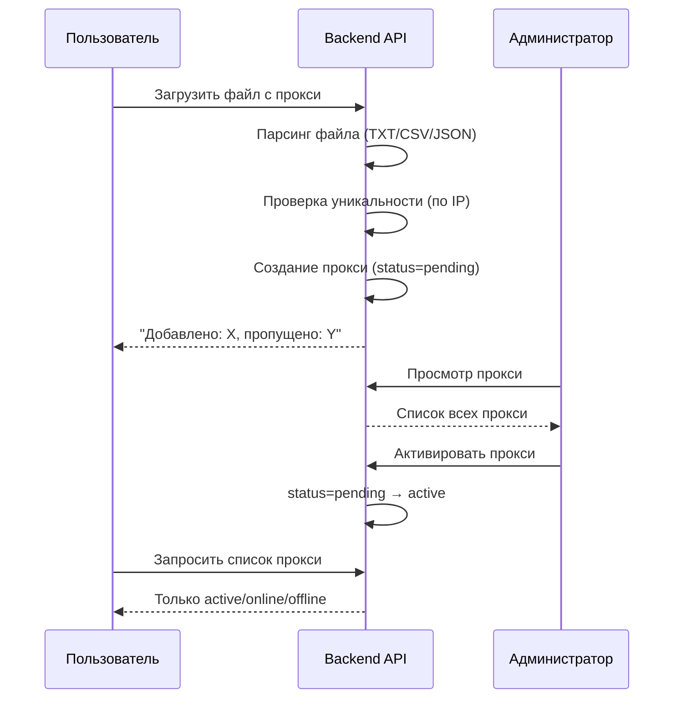

# 🌐 Система управления прокси

## Файлы примеров в корне проекта

- `proxies-example.txt` - текстовый формат (3 варианта)
- `proxies-example.csv` - CSV формат
- `proxies-example.json` - JSON формат

## Как это работает

### 1️⃣ ПОЛЬЗОВАТЕЛЬ (личный кабинет)

**Страница "Мои прокси"** (`/dashboard/proxies`)

1. Нажимает кнопку **"Загрузить Список"**
2. Выбирает файл (.txt, .csv или .json)
3. Нажимает **"Загрузить"**
4. Прокси добавляются со статусом `pending` (ожидают активации)
5. **НЕ ВИДИТ** прокси со статусом `pending` - только активированные админом

**Отображение:**
- Видит только прокси со статусами: `active`, `online`, `offline`
- Таблица: IP адрес, порт, логин, статус, дата
- Может удалить свои прокси

### 2️⃣ АДМИНИСТРАТОР (админ-панель)

**Страница "Прокси"** (`/admin/proxies`)

1. Видит **ВСЕ прокси всех пользователей**
2. Может фильтровать:
   - По пользователю
   - По статусу (pending, active, online, offline)
3. **Действия:**
   - ✅ **Активировать** - меняет статус `pending` → `active` (прокси становится видимым юзеру)
   - ❌ **Деактивировать** - меняет статус `active` → `pending` (скрывает от юзера)
   - 🗑️ **Удалить** - полное удаление прокси
   - ✅ **Активировать все pending** - массовая активация для выбранного пользователя

## Статусы прокси

| Статус | Описание | Видно юзеру? |
|--------|----------|--------------|
| `pending` | Ожидает активации админом | ❌ НЕТ |
| `active` | Активирован, готов к использованию | ✅ ДА |
| `online` | Онлайн (проверен) | ✅ ДА |
| `offline` | Офлайн (недоступен) | ✅ ДА |

## Форматы файлов

### TXT (текст, один прокси на строку)

```
203.142.75.91:8080:proxyuser1:pass123secure
user2proxy:SecurePass456@185.223.95.120:3128
91.203.15.44:8888
```

Поддерживает 3 формата:
- `IP:PORT:USERNAME:PASSWORD`
- `USERNAME:PASSWORD@IP:PORT`
- `IP:PORT` (без авторизации)

### CSV (таблица)

```csv
ip,port,username,password
203.142.75.91,8080,proxyuser1,pass123secure
185.223.95.120,3128,user2proxy,SecurePass456
```

### JSON (массив объектов)

```json
[
  {
    "ip": "203.142.75.91",
    "port": 8080,
    "username": "proxyuser1",
    "password": "pass123secure"
  }
]
```

## Уникальность

- Прокси проверяются по **IP адресу**
- Дубликаты **пропускаются**
- При загрузке показывается: "Добавлено: X, пропущено дубликатов: Y"

## Ограничения

- ✅ До **1000 прокси** на пользователя
- ✅ Размер файла: до **2 MB**
- ✅ Расширения: `.txt`, `.csv`, `.json`

## API Endpoints

### Пользователь

- `GET /api/proxies` - список активных прокси
- `POST /api/proxies/upload` - загрузка файла
- `DELETE /api/proxies/{id}` - удаление прокси

### Админ

- `GET /admin/proxies` - список всех прокси
- `POST /admin/proxies/{id}/activate` - активация
- `POST /admin/proxies/{id}/deactivate` - деактивация
- `POST /admin/proxies/activate-all` - массовая активация
- `DELETE /admin/proxies/{id}` - удаление

## Тестирование

```bash
# Загрузить TXT файл
curl -X POST http://localhost:8080/api/proxies/upload \
  -H "Accept: application/json" \
  -b cookies.txt \
  -F "file=@proxies-example.txt"

# Загрузить JSON файл
curl -X POST http://localhost:8080/api/proxies/upload \
  -H "Accept: application/json" \
  -b cookies.txt \
  -F "file=@proxies-example.json"

# Загрузить CSV файл
curl -X POST http://localhost:8080/api/proxies/upload \
  -H "Accept: application/json" \
  -b cookies.txt \
  -F "file=@proxies-example.csv"

# Получить список прокси
curl -s http://localhost:8080/api/proxies -b cookies.txt | jq
```

## Логика работы


